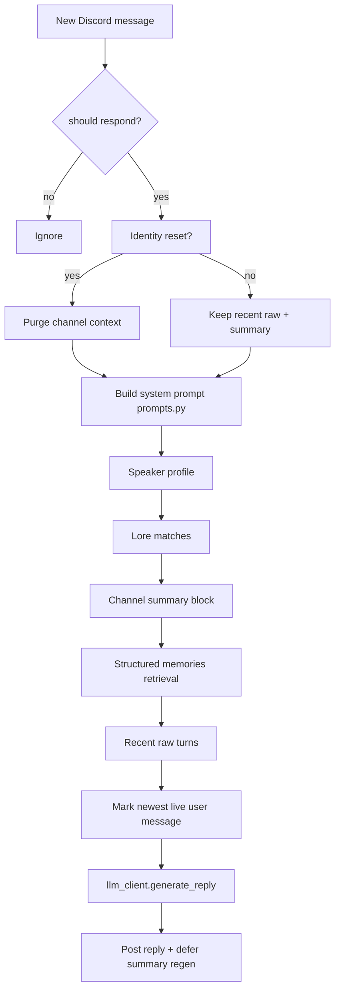

# SOPPO Developer Guide

Guide for contributors and maintainers working in this repository. Operators may prefer [USER_MANUAL.md](USER_MANUAL.md); setup lives in [README.md](../README.md).

## Repository layout

```text
soppo_discord/
├── main.py                 Entry point
├── bot.py                  Discord client, response logic, prompt assembly
├── config.py               Environment loading (see .env.example + inline docs)
├── prompts.py              Persona and prompt formatting (single source for voice rules)
├── llm_client.py           Live reply backend router
├── ollama_client.py        Ollama backend
├── openai_client.py        OpenAI + LM Studio (OpenAI-compatible) backend
├── lore.py                 Lore alias matching
├── lore_store.json         Curated lore data
├── user_profiles.py        Profile loader
├── user_profiles.json      Local profiles (gitignored)
├── memory.py               Summary helpers, neutral-summary prompt blocks
├── memory_store.py         JSON store I/O, flock locking, merge-safe saves
├── memory_extractor.py     Structured memory extraction + retrieval
├── memory_reviewer.py      Optional API memory candidate pipeline
├── memory_store.json       Runtime memory (gitignored)
├── memory_review_queue.jsonl  Human review queue (gitignored)
├── deploy/soppo-discord.service  User systemd unit template
├── tools/                  Offline memory CLI tools
├── tests/                  unittest suites
├── docs/                   Human documentation
├── AGENTS.md               Agent operating rules
├── CHANGELOG.md            Change history + verification commands
└── Kanban.md               Memory backlog board
```

There is **no** separate `lmstudio_client.py`; LM Studio uses `openai_client.py` through `llm_client.py`.

Legacy file `OLD_prompts_OLD.py` is not used by the runtime.

## Architecture boundaries

Keep responsibilities separated:

| Concern | Owner module | Do not |
|---------|--------------|--------|
| Discord events, reply decisions | `bot.py` | Scatter persona text here |
| Persona / prompt wording | `prompts.py` | Duplicate voice rules in bot |
| Env/config | `config.py` | Hardcode secrets |
| Live LLM calls | `llm_client.py` + backend clients | Call Ollama/OpenAI directly from bot |
| Lore matching | `lore.py` + `lore_store.json` | Dump full lore store every prompt |
| User context | `user_profiles.py` + JSON | Inject all profiles every turn |
| Summary persistence | `memory.py` + `memory_store.py` | Store raw Discord in health metadata |
| Structured memories | `memory_extractor.py` | Let roleplay facts become durable memory |
| API memory proposals | `memory_reviewer.py` | Auto-apply conflicts without review |

### Live vs clerical LLM backends

- **Live replies:** `LLM_BACKEND` → `generate_reply()` in `llm_client.py`
- **Neutral summaries:** `SUMMARY_LLM_BACKEND` (`reply` reuses live backend, or separate `ollama`/`openai`/`lmstudio`)
- **Memory review:** `MEMORY_REVIEW_ENABLED` + `MEMORY_REVIEW_LLM_BACKEND` (typically OpenAI)

This split lets SOPPO stay on a local personality model while summaries/review use a faster API model.

### Prompt assembly (simplified)



## Memory architecture

### Store format

`memory_store.json` is a flat JSON object:

```text
"namespace/path": {
  "record_key": { ... record fields ... }
}
```

Namespaces are slash-separated paths (see `memory_store.py`). Examples:

| Namespace pattern | Contents |
|-------------------|----------|
| `discord/guild/{guild_id}/channel/{channel_id}/summary` | Neutral channel summary + health metadata |
| `discord/dm/channel/{channel_id}/summary` | DM summary |
| `discord/guild/.../channel/.../memories` | Channel-scoped structured memories |
| `discord/user/{user_id}/memories` | User-scoped structured memories |
| `soppo/global/memories` | Global/canonical structured memories |

### Channel summaries

- Generated by a **neutral** summarizer (no SOPPO personality in the summary LLM prompt)
- Prefer **sectioned** format with headings: `Current topic:`, `Previous/closed topics:`, `Unresolved questions / open loops:`, `Durable facts:`
- Legacy unsectioned summaries still work
- Regeneration is deferred until **after** SOPPO replies on reply-generating turns
- Health fields (e.g. `messages_since_regen`, `last_regen_status`) persist; raw pending Discord content does not

### Structured memories

**Extraction:** `memory_extractor.py` deterministically pulls durable facts from rollover history (no LLM). Skips temporary roleplay/scene markers and contaminated identity terms.

**Retrieval:** `collect_relevant_structured_memories()` relevance-gates against the newest live user message. Scoped memories (user/guild/channel) fill first. **Reserved global slots** (`RESERVED_GLOBAL_MEMORY_SLOTS`) can inject high-value global identity/canon without lexical overlap.

**DM cross-channel retrieval:** In DMs only, lexically relevant guild/channel memories from other channels may surface so the operator can discuss friends; other users' `discord/user/.../memories` namespaces remain excluded.

**API review:** `memory_reviewer.py` proposes candidates post-summary; local validation applies safe items or appends to `memory_review_queue.jsonl`.

### Write safety

- `save_memory_store()` uses flock locking (`memory_store.json.lock`) and merge-safe writes
- `PersistentChannelSummaryMemory.reload_from_disk()` refreshes before structured retrieval so external tool writes are visible
- `process_memory_review_queue.py --apply-approved` blocks when `soppo-discord.service` is active (unless `--force`)

## Testing

This project uses **`unittest`**, not pytest.

```bash
./.venv/bin/python -m unittest discover -v
```

Test modules:

| Module | Focus |
|--------|-------|
| `test_channel_filtering.py` | Channel ID/name gates |
| `test_bot_author_filtering.py` | Other-bot ignore/cooldown |
| `test_prompts.py` | Prompt formatting, identity rules |
| `test_lore.py` | Lore alias matching |
| `test_channel_memory.py` | Summary persistence, health metadata |
| `test_neutral_context_memory.py` | Neutral summarizer, sectioned summaries |
| `test_structured_memory.py` | Extraction, retrieval, DM/guild boundaries, reserved globals |
| `test_memory_store.py` | Merge-safe writes, disk refresh |
| `test_followup_soft_close.py` | Follow-up window, sleep/wake, coalescing |
| `test_process_memory_review_queue.py` | Queue apply + service guard |
| `test_import_memory_candidates.py` | JSONL import converter |
| `test_memory_pruning_review.py` | Pruning review tool |
| `test_field_regressions.py` | Config/env regression checks |

After edits:

```bash
./.venv/bin/python -m compileall -q -x '(^|/)(\.venv|\.git)(/|$)' .
git diff --check
```

Add or update tests for behavior changes, especially memory retrieval boundaries and prompt wording.

## Contribution workflow

1. **Read handoff docs:** [CHANGELOG.md](../CHANGELOG.md), [Kanban.md](../Kanban.md), [AGENTS.md](../AGENTS.md)
2. **`git status`** — note dirty state before editing
3. **Small, focused diffs** — preserve working behavior unless the task explicitly changes it
4. **Run tests + compileall** (commands above)
5. **Update CHANGELOG.md** after substantive behavior or memory-system changes
6. **Update Kanban.md** when completing backlog items

### Stop and ask before

- Deleting working bot logic
- Changing Discord token/auth handling
- Replacing the prompt architecture
- Introducing a new framework
- Committing secrets or `.env`
- Broad rewrites

### Secrets and gitignored data

Never commit `.env`, tokens, logs, `memory_store.json`, `memory_review_queue.jsonl`, `user_profiles.json`, or local user-profile backups. See `.gitignore`.

`user_profiles.json` is private runtime data and must remain local-only. The public repository carries `docs/user_profiles_template.json` as the schema/example file instead. To provision a new machine, copy the template to `user_profiles.json` and fill it locally, or restore the real private file from an operator-approved backup. Do not reintroduce a tracked `user_profiles.json`; an old tracked copy can overwrite live local profiles during checkout/pull and erase Sash's current people-memory context. Tedious warning, useful scar tissue.

## Tooling reference

| Script | Mutates store? | Notes |
|--------|----------------|-------|
| `tools/inspect_memory.py` | No | Offline inspection |
| `tools/review_memory_pruning.py` | No | Review-only flags |
| `tools/import_memory_candidates.py` | No (writes queue only) | `--dry-run` supported |
| `tools/process_memory_review_queue.py` | Yes (with `--apply-approved`) | Service-active guard |
| `review_soppo_memory.sh` | Yes (apply path) | Operator wrapper |

Shared helpers: `tools/memory_inspect_common.py`

## Prompt and character work

- Runtime voice: `prompts.py` → `build_system_prompt()` and related helpers
- Long-form persona anchor: [docs/soppo_soul.md](soppo_soul.md)
- Identity snap-back and roleplay contamination rules are enforced in prompts, neutral summaries, and structured-memory extraction

Do not prefix assistant history with `[SOPPO]:` when using structured chat roles.

## Extending the bot

Reasonable extension points:

- **Slash commands:** add `discord.app_commands` in bot setup (not present today)
- **Per-channel settings:** extend channel gate in `bot.py` or config
- **New LLM backend:** add client module + route in `llm_client.py` + config validation
- **Lore/profiles:** edit JSON data files; no code change unless schema changes

## Documentation maintenance

When changing behavior:

1. Update [CHANGELOG.md](../CHANGELOG.md) with verification commands and results
2. Update [README.md](../README.md), [USER_MANUAL.md](USER_MANUAL.md), or this file if operator/developer workflows change
3. Update [Kanban.md](../Kanban.md) when backlog items complete

If unsure about current behavior, document the uncertainty rather than inventing features.
